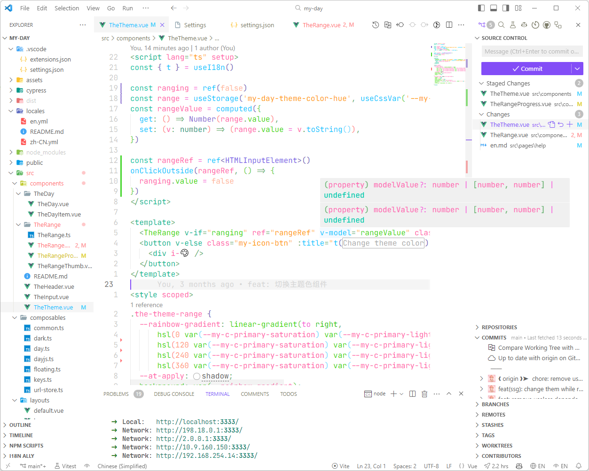

<h1 align="center">Liquid Ray</h1>

<h3 align="center">A seamless colorful unibody vscode theme</h3>

> code inspire by [Vitesse Theme for VS Code](https://github.com/antfu/vscode-theme-vitesse)
>
> color inspire by PANTONE GG1504A

## Preview

### Dark

### Light

## End

Hope you like it!
